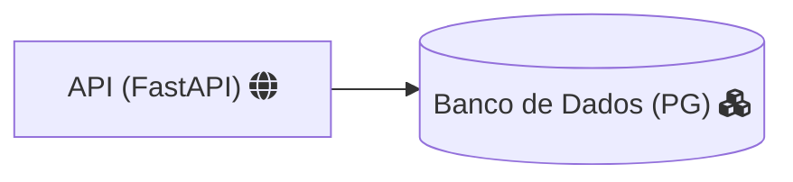
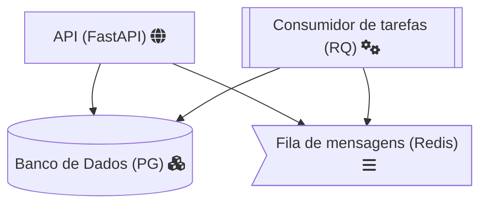

# Funcionalidades

## Usuários

- Registro de novos funcionários **via CLI e via API**
  - CLI: `dundie create-user [Nome] [Email] [Password Inicial] [departamento]`
  - API: `POST /user/ data={nome:.., email:.., departamento:.., password:..}`
  - Usuários do departamento `management` são considerados super usuáripos
  - O `username` é gerado a partir do slug do nome do usuário `Pam Besly` -> `pam-besly`
- Autenticação de usuários com JWT token
  - Para usar a API será necessário uma chamada `GET /token data={username, password}` e todas as chamadas subsequentes precisarão do token informado nos `HEADERS`.
- O usuário pode requisitar um token para alteração de senha

## Transações 

- Transações não podem ser deletadas ou canceladas, cada transação
  é um item no histórico da conta do usuário em questão.
- Qualquer usuário com um token poderá fazer uma chamada para `POST /transaction/username/ data={value=100}` esta chamada adiciona um novo registro na tabela `Transaction` contento `user_id: <usuario_dono_da_conta>, from_id: <usuário que fez o depósito>, value: <integer>, date: <timestamp>`
- O usuário só poderá fazer uma transação caso o saldo da sua própria conta seja suficiente para cobrir o custo da transação.
- O saldo de um usuário é a soma de todas as suas transações.

Endpoints:

- `POST /transaction/username/` - Registra uma transação para um usuário
  - Acesso: `Geral`
  - Validação: O usuário autenticado é o `from_id` da transação e deve ter saldo suficiente.
- `GET /transaction/username/` - Retorna as transações de um usuário incluindo seu `balance` (saldo todal) 
  - Acesso: `Manager` ou `username == current_user`
- `GET /transaction/` - Retorna todas as transações

## API Spec

## Arquitetura

### Fase 1

- 1 Serviço de API 
- 1 Serviço de Banco de Dados

### Fase 2

- 1 Serviço de API
- 1 Serviço de Banco de Dados
- 1 Serviço consumidor de tarefas (RQ)
- 1 Serviço de fila de mensagens (Redis)

Agora vamos ver como será a estrutura dos arquivos -->
