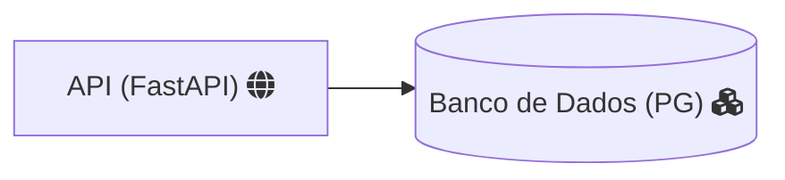

# Orquestrando serviços

Os serviços:


## Docker compose

Para iniciar a nossa **API** + o **Banco de dados** vamos precisar de um
orquestrador de containers, em produção isso será feito com Kubernetes
mas no ambiente de desenvolvimento podemos usar o **docker compose**.

No arquivo `docker-compose.yaml`

- Definimos 2 serviços `api` e `db`
- Informamos os parametros de build com os dockerfiles
- Na `api` abrimos a porta `8000`
- Na `api` passamos 2 variáveis de ambiente `DUNDIE_DB__uri` e `DUNDIE_DB_connect_args` para usarmos na conexão com o DB
- Marcamos que a `api` depende do `db` para iniciar.
- No `db` informamos o setup básico do postgres e pedimos para criar 2 bancos de dados, um para a app e um para testes.

`docker-compose.yaml`
```yaml
version: '3.9'

services:
  api:
    build:
      context: .
      dockerfile: Dockerfile.dev
    ports:
      - "8000:8000"
    environment:
      DUNDIE_DB__uri: "postgresql://postgres:postgres@db:5432/${DUNDIE_DB:-dundie}"
      DUNDIE_DB__connect_args: "{}"
      SQLALCHEMY_SILENCE_UBER_WARNING: 1
    volumes:
      - .:/home/app/api
    depends_on:
      - db
    stdin_open: true
    tty: true
  db:
    build: postgres
    image: dundie_postgres-13-alpine-multi-user
    volumes:
      - dundie_pg_data:/var/lib/postgresql/data
    ports:
      - "5432:5432"
    environment:
      - POSTGRES_DBS=dundie, dundie_test
      - POSTGRES_USER=postgres
      - POSTGRES_PASSWORD=postgres

volumes:
  dundie_pg_data:
```

O próximo passo é estando na raiz do repositório executar:

```bash
docker compose up -d
```
```admonish info
Na primeira execução poderá demorar mais termpo pois as imagens serão construidas.
```
```admonish warning
Se o comando `docker compose` não funcionar tente usar `docker-compose` (com um traço - )
```


Para verificar os serviços que estão rodando:

```console
$ docker compose ps
       Name                     Command               State           Ports
    api_1             /bin/sh -c uvicorn dundie...     Up             8000
    db_1             docker-entrypoint.sh postgres     Up             5432
```


```admonish tip
Os serviços ficarão em execução em segundo plano, se quiser manter o terminal aberto para acompanhar os logs pode omitir o `-d` ou então abrir um segundo terminal e executar `docker compose logs --follow`
```
