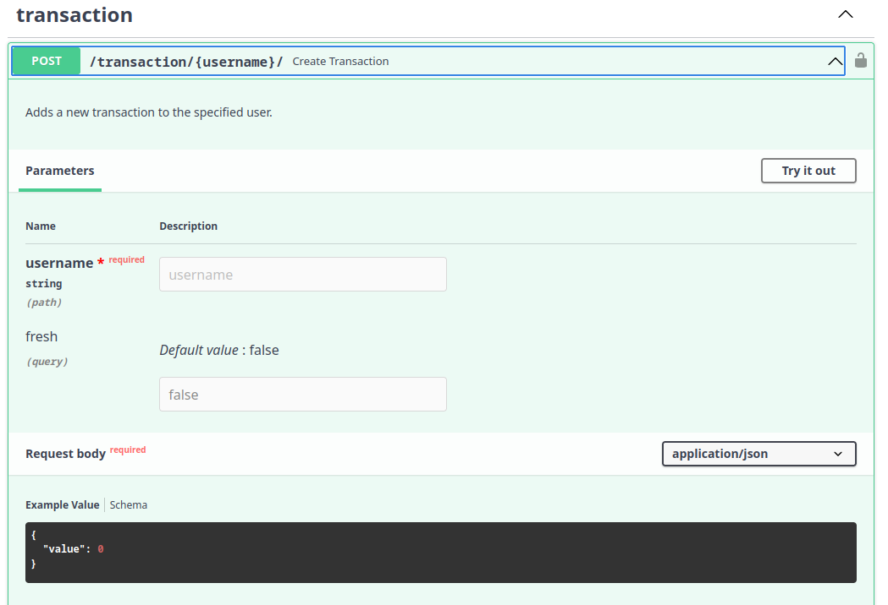

# Transaction API

Agora podemos finalmente criar o endpoint na API que vai fornecer a mesma funcionalidade,
porém com algumas diferenças entre a implementação que fizemos no CLI, 
no caso da API o `from_user` será o usuário que estiver autenticado.

**EDITE** `dundie/routes/transaction.py` e adicione o seguinte código:

```python
from fastapi import APIRouter, Body, HTTPException
from dundie.auth import AuthenticatedUser
from dundie.db import ActiveSession
from dundie.models import User
from dundie.tasks.transaction import add_transaction, TransactionError
from sqlmodel import select, Session

router = APIRouter()


@router.post('/{username}/', status_code=201)
async def create_transaction(
    *,
    username: str,
    value: int = Body(embed=True),
    current_user: User = AuthenticatedUser,
    session: Session = ActiveSession
):
    """Adds a new transaction to the specified user."""
    user = session.exec(select(User).where(User.username == username)).first()
    if not user:
        raise HTTPException(status_code=404, detail="User not found")

    try:
        add_transaction(user=user, from_user=current_user, value=value, session=session)
    except TransactionError as e:
        raise HTTPException(status_code=400, detail=str(e))

    # At this point there was no error, so we can return
    return {"message": "Transaction added"}
```

Agora podemos adicionar essas rotas no router principal editando `dundie/routes/__init__.py`

```python
from fastapi import APIRouter
from .auth import router as auth_router
from .user import router as user_router
from .transaction import router as transaction_router

main_router = APIRouter()

main_router.include_router(auth_router, tags=["auth"])
main_router.include_router(user_router, prefix="/user", tags=["user"])
main_router.include_router(transaction_router, prefix="/transaction", tags=["transaction"])
```

Neste momento o endpoint já deve aparecer na API.



> **OBS** o parâmetro `fresh` que vemos na API se refere a possibilidade de renovar o token de autenticação.

E podemos testar fazendo uma requisição HTTP.

> **Lembre-se** de trocar o token pelo token gerado a partir da URL /token/, por exemplo, gerando um token para o usuário `admin` ou outro superuser permitirá a adição de pontos infinitos, usando token de um usuário comum permitirá apenas o envio de pontos comportados pelo saldo do usuário.

Adicionando 300 pontos ao usuário Bruno Rocha.

```console
$ curl -X 'POST' \
  -H 'Content-Type: application/json' \
  -H 'Authorization: Bearer TOKEN_AQUI' \
  --data-raw '{"value": 300}' \
  -k 'http://localhost:8000/transaction/bruno-rocha/'
```

Adicione algumas transactions e vamos partir para a API de filtragem e exibição -->
