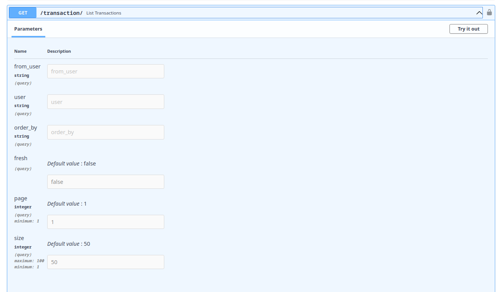

# Filtrando dados

Agora que já podemos trocar pontos entre usuários vamos criar endpoints onde será possivel consultar
as transações e saldos.

- `POST /transaction/{username}/` (feito) - adiciona transação 
- `GET /transaction/` - Lista todas as transações 
    - Se `superuser` exibe todas, caso contrário apenas as próprias.
    - permite filtros: `?from_user=username`, `?user=username`
    - permite ordenação: `?order_by=from_user,user,value,date`
    - permite paginação: `?page=1&size=10` 


Antes de criarmos o endpoint precisamos criar um model de saida, `TransactionResponse`
para evitar o retorno do próprio model do banco de dados e se fizermos isso em `dundie/models/transaction.py` teremos um problema de circular imports.

```diff
- # !!!! Exemplo em dundie/models/transaction.py
- from dundie.models.user import User   # <- CIRCULAR IMPORT 
```

Para contornar este problema de maneira simples, vamos agora criar um novo arquivo, desta forma isolamos o import e evitamos o import circular.

> **OBS** Neste momento vamos colocar apenas o serializar para Transaction neste novo módulo 
> mas futuramente podemos mover todos os serializers definidos em `models/user.py` e `models/transaction.py` 
> para este mesmo módulo também.

Neste serializer vamos utilizar `root_validator` para criar campos que são calculados no 
momento da serialização.

**CRIE** o arquivo `dundie/models/serializers.py` 

> VocÊ pode criar usando `touch dundie/models/serializers.py` ou usando seu IDE ou navegador de arquivos.

```python
from datetime import datetime
from typing import Optional

from pydantic import BaseModel, root_validator
from sqlmodel import Session

from dundie.db import engine

from .user import User


class TransactionResponse(BaseModel, extra="allow"):
    id: int
    value: int
    date: datetime

    # These 2 fields will be calculated at response time.
    user: Optional[str] = None
    from_user: Optional[str] = None

    @root_validator(pre=True)
    def get_usernames(cls, values: dict):
        with Session(engine) as session:
            user = session.get(User, values["user_id"])
            values["user"] = user and user.username
            from_user = session.get(User, values["from_id"])
            values["from_user"] = from_user and from_user.username
        return values
```

Podemos testar no shell com:

```console
$ docker compose exec api dundie shell
Auto imports: ['settings', 'engine', 'select', 'session', 'User', 
               'Transaction', 'Balance', 'add_transaction']

In [1]: from dundie.models.serializers import TransactionResponse

In [2]: t = session.get(Transaction, 1)

In [3]: TransactionResponse.parse_obj(t)
Out[3]: TransactionResponse(
    value=100, 
    date=datetime.datetime(2023, 1, 6, 12, 21, 55, 30204), 
    user='bruno-rocha', 
    from_user='michael-scott', 
    user_id=2, 
    from_id=1, 
    id=1
)
```

Agora vamos **EDITAR** o arquivo `dundie/routes/transaction.py`

```python
# No topo

from fastapi_pagination import Page, Params
from fastapi_pagination.ext.sqlmodel import paginate
from dundie.models import Transaction
from dundie.models.serializers import TransactionResponse
from sqlmodel import text
from sqlalchemy.orm import aliased

# No final do arquivo
@router.get("/", response_model=Page[TransactionResponse])
async def list_transactions(
    *,
    current_user: User = AuthenticatedUser,
    session: Session = ActiveSession,
    params: Params = Depends(),
    from_user: Optional[str] = None,
    user: Optional[str] = None,
    order_by: Optional[str] = None,
):
    query = select(Transaction)

    # Optional `AND` filters
    if user:
        query = query.join(
            User, Transaction.user_id == User.id
        ).where(User.username == user)
    if from_user:
        FromUser = aliased(User)  # aliased needed to desambiguous the join
        query = query.join(
            FromUser, Transaction.from_id == FromUser.id
        ).where(FromUser.username == from_user)

    # Mandatory access filter
    # regular users can only see their own transactions
    if not current_user.superuser:
        query = query.where(
            Transaction.user_id == current_user.id | Transaction.from_id == current_user.id
        )

    # Ordering based on &order_by=date (asc) or -date (desc)
    if order_by:
        order_text = text(
          order_by.replace("-", "") + " " + ("desc" if "-" in order_by else "asc")
        )
        query = query.order_by(order_text)

    # wrap response_model in a pagination object {"items": [], total, page, size }
    return paginate(query=query, session=session, params=params)
```

Agora temos um novo endpoint listando todas as transactions e com os filtros que especificamos.



```console
$ curl 'GET' -H 'Content-Type: application/json' \
    -H 'Authorization: Bearer TOKEN_AQUI' \
    -k 'http://localhost:8000/transaction/\
    ?page=1&size=2&from_user=michael-scott&user=bruno-rocha&order_by=-date'
```
```json
#+RESPONSE
{
  "items": [
    {
      "id": 12,
      "value": 300,
      "date": "2023-01-10T17:08:29.953452",
      "user": "bruno-rocha",
      "from_user": "michael-scott",
      "from_id": 1,
      "user_id": 2
    },
    {
      "id": 11,
      "value": 112,
      "date": "2023-01-10T17:07:49.296277",
      "user": "bruno-rocha",
      "from_user": "michael-scott",
      "from_id": 1,
      "user_id": 2
    }
  ],
  "total": 6,
  "page": 1,
  "size": 2
}
#+END
```

```admonish note "NOTA"
Repare que como usamos o plugin fastapi_pagination agora o formato da resposta está diferente contendo `items`, `total`, `page` e `size`
```

## Revisão da API 

Agora que já temos bastante funcionalidade na API vamos revisar e identificar o que está faltando.

### Auth 

- POST /token - login via formulário para gerar acccess token 
- POST /refresh_token - Obter um novo token sem a necessidade de fazer login novamente

### User 

- GET /user/ -  Lista todos os usuários
- GET /user/{username} - Lista um usuário específico
- POST🔒 /user/ - Cria um novo usuário 
- PATCH🔒 /user/{username} - Altera informações do usuário 
- POST  /user/{username}/password - Altera a senha do usuário (?pwd_reset_token ou 🔒)
- POST /user/pwd_reset_token/ - Solicita um token via email para resetar a senha (?email)

### Transaction 

- POST🔒 /transaction/ - Cria uma nova transaction de `from_user para user`
- GET🔒 /transaction/ - Lista transactions do usuário logado (ou todas em caso de superuser)
    - filters: `user`, `from_user`
    - sort: `order_by=date` (asc) ou `-date` (desc)
    - pagination: `page`, `size`


Mas ainda falta informação neste retorno, onde está o saldo total do usuário? vamos resolver -->
