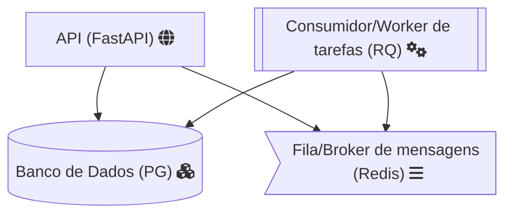
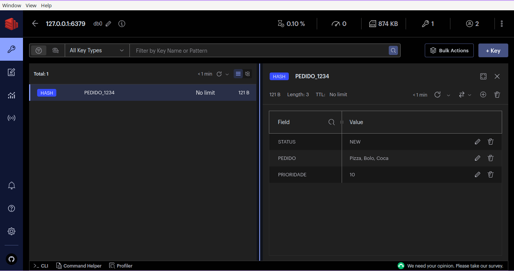
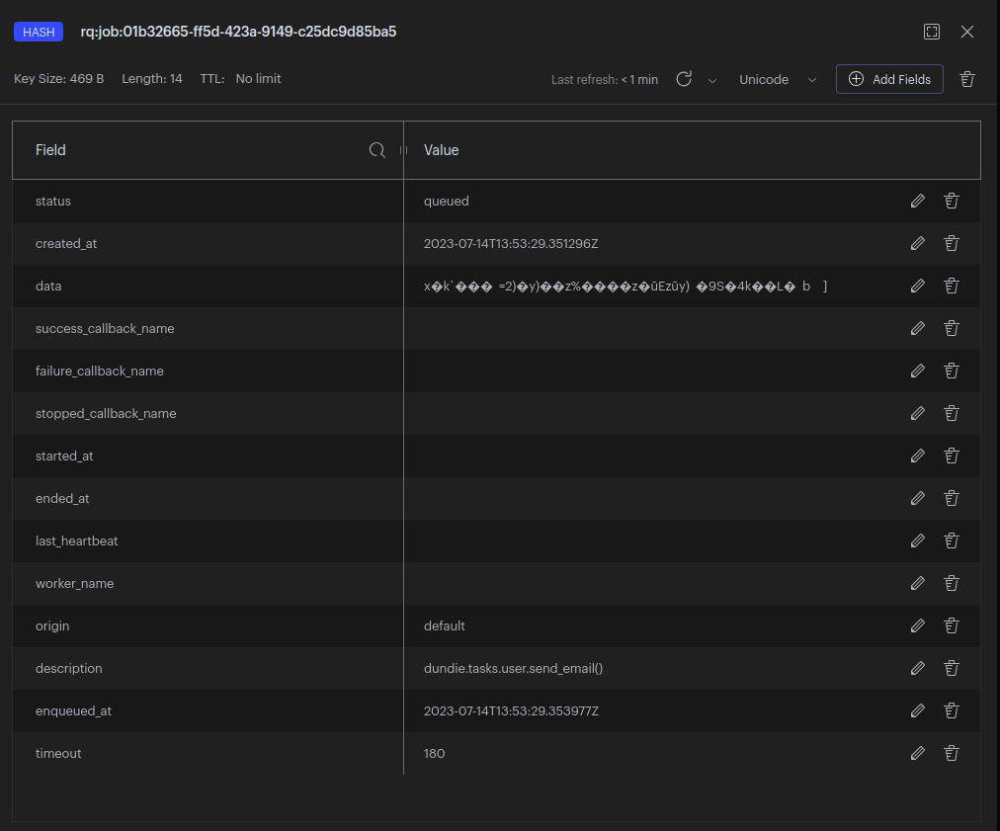
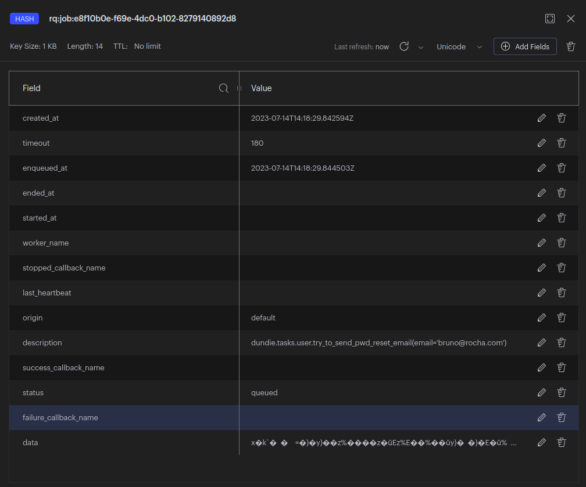
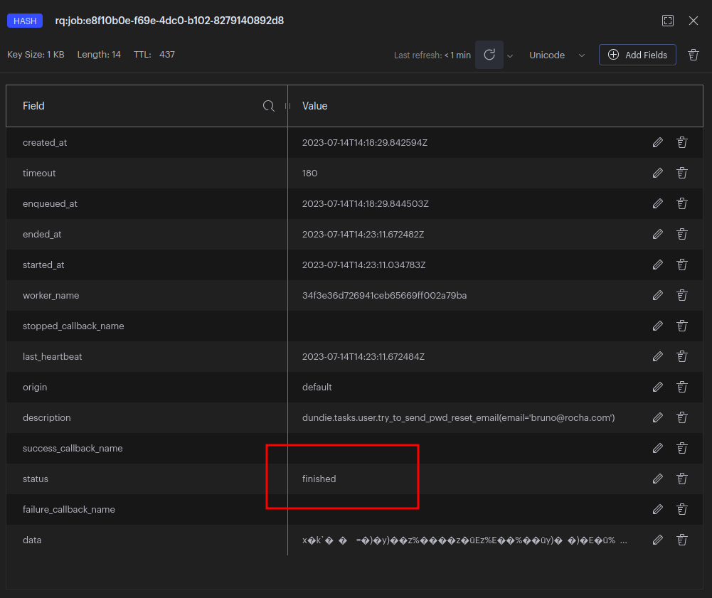

# Task Queue

Enfileiramento de tarefas é uma abordagem que permite
distribuir o procesamento de tarefas en diferentes
unidades de processamento para obter um melhor desempenho
e uma gestão mais fácil da escalabilidade do projeto.

Imagine que temos a tarefa de enviar um email como
fizemos anteriormente usando BackGround Tasks do FastAPI,
agora assuma que temos que enviar centenas ou até milhares
de e-mails de uma só vez.

Para evitar que a aplicação fique sobrecarrega ao executar
em um único processo, nós partimos para uma arquiretura
de computação distribuida, onde poderemos ter várias
instâncias de um worker sendo executados em paralelo.

Alguns conceitos importantes:

**BROKER**:

É o serviço que gerencia a fila de tarefas,
entre os mais conhecidos temos o RabbitMQ, Redis, Kafka,
simplificando é o serviço que recebe as tarefas e as
coloca em uma fila para ser executada, uma analogia
simples é pensar neste componente como um caixa de uma
lanchonete que anota os pedidos e os coloca em uma fila
distribuindo o trabalho entre os cozinheiros.

Para este projeto vamos usar o REDIS como BROKER.

```admonish warning
O Redis é um banco de dados em memória, ele por si só
não é considerado um message BROKER, ou seja, ele precisa
de um outro processo para gerenciar as mensagens enfileiras
nós usaremos REDIS como Broker pois o RQ faz o trabalho
de gerenciar as mensagens no REDIS.

Em ambientes produtivos de alta escalabilidade é mais
recomendado usar RabbitMQ, Kafka ou serviços especificos
de cloud providers como o AWS SQS como Broker.
```

**TASK**:

É a tarefa que ficará disponível para ser executada,
geralmente usamos decorators em Python ou uma chamada de
função para registrar uma task, assim que registrada
a task fica disponível e o BROKER pode validar o
enfileiramento. Imagine que a task é um item do cardapio
de um restaurante.

Existem vários sistemas de gestão de filas para Python
cada um com um jeito específico de registrar uma task,
alguns conhecidoss são: Celery, Dramatiq, RQ, Huey.

Em nosso projeto vamos usar o RQ pois é o mais simples
de configurar e usar.

**PRODUCER**:

É o mecanismo que envia a tarefa para o BROKER,
geralmente em Python usamos uma chamada de função
onde passamos qual a task a ser enfileirada e os
parametros necessários para a execução, além
disso em alguns casos podemos definir coisas como
tempo de expiração da tarefa, prioridade, callback
e rotear para uma fila especifica. Imagine que
o producer é o garçom que anota o pedido e leva
até o caixa.

A produção de tarefas pode ser feita em qualquer
parte do projeto, usando mecanismos providos pelo
RQ iremos usar chamadas de função que enfileiram as
mensagens diretamente no REDIS.

**CONSUMER ou WORKER**:

Com as tasks enfileiradas e devidamente configuradas
precisamos de um componente que de fato irá executar
a tarefa e tomar conta de coisas como contexto,
re-execução, falhas, logs etc.

Imagine que o consumer (ou trabalhador) é o cozinheiro
que recebe o pedido e que precisa executar a tarefa
de preparo levando em consideração o contexto do pedido,
a receita, a prioridade etc.

O RQ já fornece um mecanismo de worker que podemos
usar diretamente no terminal ou integrar a um
sistema de gestão de processos como o supervisord ou
o systemd.

## Arquitetura

Agora teremos que começar alterando a arquitetura
de componentes da nossa infraestrutura.

Nesta Fase 2 do Projeto adicionaremos o serviço
de fila de mensagens e o serviço consumidor de tarefas.

- 1 Serviço de API
- 1 Serviço de Banco de Dados
- 1 Serviço consumidor de tarefas (RQ)
- 1 Serviço de fila de mensagens (Redis)



Para começar vamos adicionar o serviço de fila de mensagens
usando o REDIS, para isso vamos editar o arquivo
`docker-compose.yml` e adicionar o serviço:


```yaml
  redis:
    image: redis:6.2.5-alpine
    restart: always
    ports:
      - "6379:6379"
    volumes:
      - dundie_redis_data:/data

volumes:
  dundie_pg_data:
  dundie_redis_data:
```

Após editar o arquivo vamos subir o serviço:

```bash
docker compose down
docker compose up -d
```

O client GUI oficial é o RedisInsight, você pode baixar
no site oficial: https://redislabs.com/redis-enterprise/redis-insight/

Se preferir acesssar via terminal pode usar o redis-cli: https://redis.io/docs/ui/cli/


Dentro do RedisInsight vamos criar uma conexão com o REDIS e geralmente
ele já irá detectar o REDIS que está sendo executado no localhost.

Podemos então criar chaves:



## Tarefas

Usando o Python-RQ qualquer função pode ser enfileirada como uma tarefa,
não há necessidade de registrar a task como em outros sistemas de gestão
de filas como o Celery, no RQ basta que o worker tenha acesso ao mesmo
contexto da função que será executada.

Em nosso projeto já possuimos uma função que envia e-mail, vamos então
enfileirar esta função como uma task.

### Enfileirando a Task

Para enfileirar uma task vamos precisar de uma conexão com o REDIS,
e uma instancia da fila do RQ.

O primeiro passo é editar o nosso arquivo de requirements e adicionar
as dependencias do RQ:

Adicione ao arquivo `requirements.in`:

```plain
rq               # Task Queue
```

O pacote rq já irá instalar o Redis,
precisamos agora atualizar o arquivo `requirements.txt`:

Em seu computador (fora do container) execute:
```
pip install pip-tools
pip-compile requirements.in
cat requirements.txt | grep rq
```

A saida deve ser algo como:

```
   # rq
   # via rq
rq==1.15.1
```

Agora podemos fazer o rebuild da imagem do serviço API:

```
docker compose down
docker compose build api
docker compose up -d
```

Agora podemos entrar no shell e interagir com o Redis só para confirmar
que está tudo funcionando:

```
docker compose exec api dundie shell
```
E dentro do shell

```python
from redis import Redis
from rq import Queue
q = Queue(connection=Redis("redis"))
from dundie.tasks.user import send_email
result = q.enqueue(send_email)
print(result)
```

O retorno será algo como:

```
Job(
  '01b32665-ff5d-423a-9149-c25dc9d85ba5',
  enqueued_at=datetime.datetime(2023, 7, 14, 13, 53, 29, 353977)
)
```

Agora podemos abrir o RedisInsight e ver que a chave
`rq:job:01b32665-ff5d-423a-9149-c25dc9d85ba5` foi criada.
e dentro dela temos o conteúdo da task:





Portanto já sabemos como faxer para enfileiras uma task no BROKER,
essa task ainda não será executada enquanto não tivermos um worker
consumindo as tarefas.

Mas primeiro vamos estruturar o nosso projeto para produzir tasks via API.

Começamos editando o arquivo de configuraçoes, `default.toml`

```toml
[default.redis]
host = "redis"
port = 6379
```

Desta forma caso seja necessário alterar a configuração do REDIS podemos fazer
via variáveis de ambiente pois o Dynaconf faz a gestão das configurações.

```
# exemplo
DUNDIE_REDIS_HOST="meuhost"
```

Agora criaremos um arquivo novo `dundie/queue.py`

```python
from redis import Redis
from rq import Queue
from dundie.config import settings

redis = Redis(
    host=settings.redis.host,
    port=settings.redis.port,
)

queue = Queue(connection=redis)
```

agora podemos testar no shell:

```bash
docker compose exec api dundie shell
```

```python
from dundie.queue import queue
from dundie.tasks.user import send_email
queue.enqueue(send_email)
```

E agora no REDIS podemos ver que a chave foi criada com os detalhes
da nova task.

> apague essas tasks do REDIS antes de continuar.

Agora vamos alterar o nosso endpoint de pedido de recuperação de senha
para ao invés de enviar o e-mail com a BackgroundTask, enfileirar uma task
no Redis para usar o processamento distribuido.


Edite `dundie/routes/user.py` e no topo faça a importação da
`queue`.

```python
from dundie.queue import queue
```

e nele vamos alterar a função
`send_password_reset_token` para enfileirar a task
portanto troque a linha:

```diff
- background_tasks.add_task(try_to_send_pwd_reset_email, email=email)
+ queue.enqueue(try_to_send_pwd_reset_email, email=email)
```

Reinicie os serviços e agora vamos testar via API:

```bash
docker compose down
docker compose up -d
```

Acesse

http://localhost:8000/docs#/user/send_password_reset_token_user_pwd_reset_token__post

E dispare um pedido de recuperação de senha.

Ou via CURL:

```bash
curl -X 'POST' \
  'http://localhost:8000/user/pwd_reset_token/' \
  -H 'accept: application/json' \
  -H 'Content-Type: application/json' \
  -d '{
  "email": "bruno@rocha.com"
}'
```
```json
{
  "message": "If we found a user with that email, we sent a password reset token to it."
}
```

Agora veja se tudo deu certo no RedisInsight:



Já estamos produzindo tasks!!!

Agora vamos criar um worker para consumir as tasks.


## Worker ou Consumer

Para testar podemos simplesmente executar o worker no shell:

```bash
docker compose exec api bash
```
```console
~/api$ rq worker --url redis://redis:6379 --with-scheduler
14:23:11 Worker rq:worker:34f3e36d726941ceb65669ff002a79ba started with PID 20, version 1.15.1
14:23:11 Subscribing to channel rq:pubsub:34f3e36d726941ceb65669ff002a79ba
14:23:11 *** Listening on default...
14:23:11 Scheduler for default started with PID 22
14:23:11 Cleaning registries for queue: default
14:23:11 default: dundie.tasks.user.try_to_send_pwd_reset_email(email='bruno@rocha.com') (e8f10b0e-f69e-4dc0-b102-8279140892d8)
14:23:11 default: Job OK (e8f10b0e-f69e-4dc0-b102-8279140892d8)
14:23:11 Result is kept for 500 seconds
```

No Result é possível ver o ID da task que foi executada e o seu
status alterado para finished.



Este resultado foca disponivel por 500 segundos, depois disso
ele é limpo automaticamente do Redis.

Saia do terminal pressionando `CTRL+C` seguido de `docker compose down`

Agora nosso próximo passo é criar um serviço para executar o worker em
segundo plano dentro de um container.

Vamos editar o arquivo `docker-compose.yml` e adicionar um novo serviço

```yaml
  worker:
    build:
      context: .
      dockerfile: Dockerfile.dev
    environment:
      DUNDIE_DB__uri: "postgresql://postgres:postgres@db:5432/${DUNDIE_DB:-dundie}"
      DUNDIE_DB__connect_args: "{}"
      SQLALCHEMY_SILENCE_UBER_WARNING: 1
    volumes:
      - .:/home/app/api
    depends_on:
      - db
      - redis
    stdin_open: true
    tty: true
    command: rq worker --with-scheduler --url redis://redis:6379
```

E agora vamos executar novamente os serviços e dessa vez teremos o
worker iniciado.

```bash
docker compose up -d
```
```
[+] Running 5/5
 ⠿ Network dundie-api_default     Created                                                                      0.0s
 ⠿ Container dundie-api-redis-1   Started                                                                      0.6s
 ⠿ Container dundie-api-db-1      Started                                                                      0.6s
 ⠿ Container dundie-api-api-1     Started                                                                      1.7s
 ⠿ Container dundie-api-worker-1  Started
```

Abra o log do worker:

```console
$ docker compose logs worker --follow
dundie-api-worker-1  | 14:33:39 Worker rq:worker:fc005b5371eb43bf90dd5ba688a72e8f started with PID 1, version 1.15.1
dundie-api-worker-1  | 14:33:39 Subscribing to channel rq:pubsub:fc005b5371eb43bf90dd5ba688a72e8f
dundie-api-worker-1  | 14:33:39 *** Listening on default...
dundie-api-worker-1  | 14:33:39 Scheduler for default started with PID 7
```

E agora dispare mais pedidos de recuperação de senha via API/;

```bash
curl -X 'POST' \
  'http://localhost:8000/user/pwd_reset_token/' \
  -H 'accept: application/json' \
  -H 'Content-Type: application/json' \
  -d '{
  "email": "bruno@rocha.com"
}'
```

Verá que no log do worker aparecerá a task sendo executada.

```console
dundie-api-worker-1  | 14:36:01 default: dundie.tasks.user.try_to_send_pwd_reset_email(email='bruno@rocha.com') (14e53a7a-7fb9-4bc1-896a-5d0341e6b281)
dundie-api-worker-1  | 14:36:02 default: Job OK (14e53a7a-7fb9-4bc1-896a-5d0341e6b281)
dundie-api-worker-1  | 14:36:02 Result is kept for 500 seconds
```

Aconselho ler a documentação do RQ em [Python RQ Docs](https://python-rq.org/docs/)

Em nossa próxima aula iremos agendar tarefas com o scheduler do RQ.
