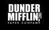
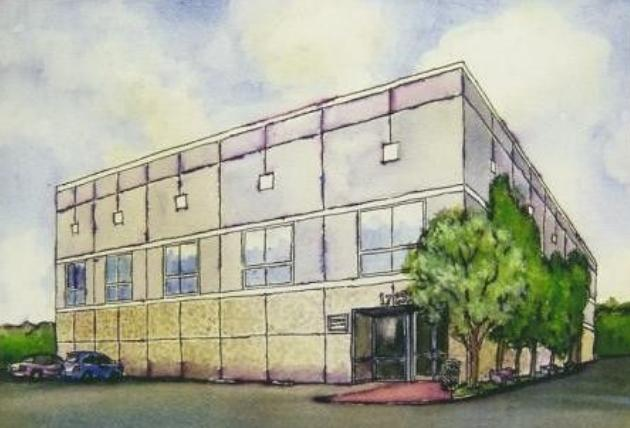
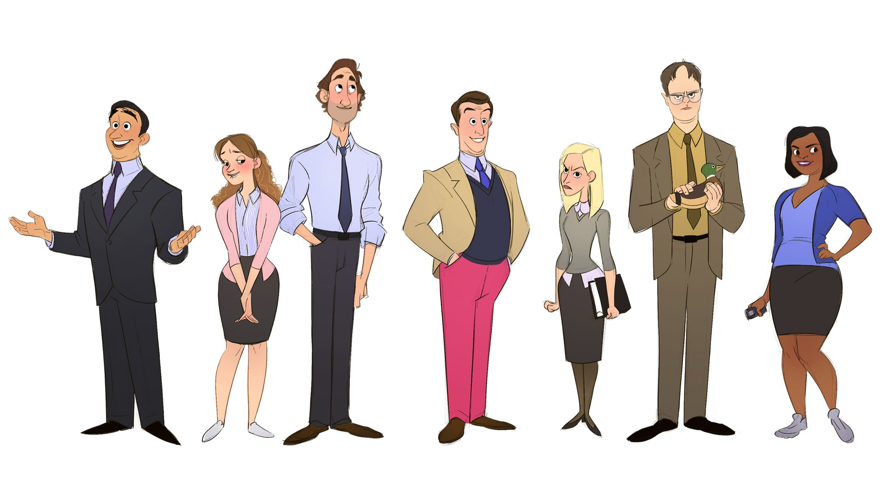

# O problema que vamos resolver

A Dunder Mifflin é a maior e mais bem sucedida empresa de papéis do mundo

---

Este é Michael Scott, gerente regional da Dunder Mifflin
de Scranton, Pensilvania.

Ele se acha o melhor gerente do mundo, mas na verdade
é [bem sem graça e as vezes até inconveniente](https://youtu.be/i7b7ldR8N_g).

 

---

Este é o time de funcionários que o Michael gerencia, eles estão 
com cara de alegres (com excessão da Angela), porém nem todos estão felizes, eles estão na verdade bastante desmotivados e começaram a reclamar das piadas sem graça do Michael e da falta de reconhecimento da empresa. 

<figure>
  
  <figcaption>Equipe: Michael, Pam, Jim, Andy, Angela, Dwight, Kelly</figcaption>
</figure>

---

## Projeto Dundie Rewards

A Dunder Mifflin nos contratou para desenvolver uma API para o 
novo projeto **Dundie Rewards**, que consiste em um sistema de 
recompensas onde **cada funcionário terá uma conta** e irá **ganhar pontos**.

Esses pontos poderão ser atribuidos pelo Michael quando ele achar
que um funcionário merece, automaticamente em datas especiais
ou em batimento de metas, e os funcionários poderão trocar pontos
entre eles como forma de reconhecimento do trabalho dos colegas.

Ao final do ano, os funcionários vão poder trocar seus pontos por
dinheiro para gastar como quiserem.

Vamos começar este projeto desenvolvendo a estrutura de pastas, a orquestração do ambiente, a modelagem de dados e a API.

Futuramente na fase 2 iremos integrar com um front-end.
