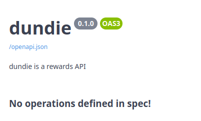

# Criando um container

Vamos agora verificar o `Dockerfile.dev` que está na raiz do repositório e será a imagem responsável por executar nossa api.

`Dockerfile.dev`

```bash
# Build the app image
FROM python:3.10

# Create directory for the app user
RUN mkdir -p /home/app

# Create the app user
RUN groupadd app && useradd -g app app

# Create the home directory
ENV APP_HOME=/home/app/api
RUN mkdir -p $APP_HOME
WORKDIR $APP_HOME

# install
COPY . $APP_HOME
RUN pip install -r requirements-dev.txt
RUN pip install -e .

RUN chown -R app:app $APP_HOME
USER app

CMD ["uvicorn","dundie.app:app","--host=0.0.0.0","--port=8000","--reload"]

```

O arquivo acima define o passo a passo para construir uma imagem de container customizada a partir da `python:3.10`, neste script de cosntrução da imagem estamos criando diretórios, ajustando permissões, copiando arquivos da aplicação e isntalando dependencias, além de definirmos o comando principal de execução do programa.


Com esta definição pronta o próximo passo é construir a imagem do container:

```bash
docker build -f Dockerfile.dev -t dundie:latest .
```

Agora em nosso sistema teremos uma imagem chamada `dundie` com a tag `latest` e podemos executar.

```console
$ docker run --rm -it -v $(pwd):/home/app/api -p 8000:8000 dundie

INFO:     Will watch for changes in these directories: ['/home/app/api']
INFO:     Uvicorn running on http://0.0.0.0:8000 (Press CTRL+C to quit)
INFO:     Started reloader process [1] using StatReload
INFO:     Started server process [8]
INFO:     Waiting for application startup.
INFO:     Application startup complete.
```

Acesse: [http://0.0.0.0:8000/docs](http://0.0.0.0:8000/docs) e terá acesso a página default da OpenAPI spec que acompanha o FastAPI.



Ainda não temos rotas definidas portanto podemos passar o próximo passo.
