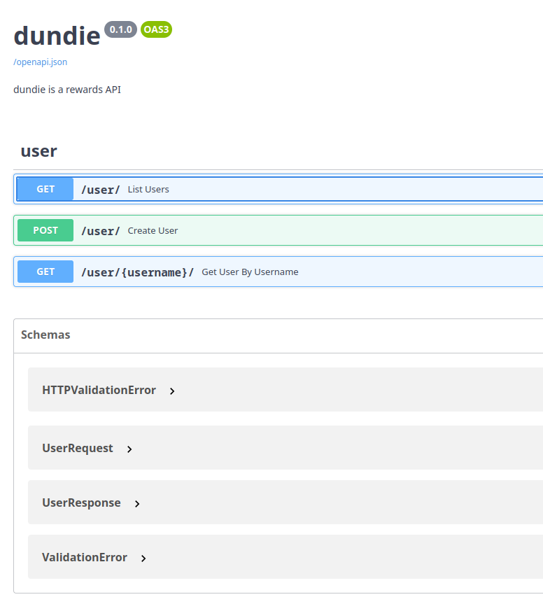

# Roteamento de URL

Com as funções já prontas agora podemos fazer o roteamento, que é o processo
de mapear uma URL como `/user/` a uma função como a `user_list` que criarmos,
ou seja, sempre que o servidor receber um request na URL `/user/` irá executar
a função mapeada passando todo o contexto HTTP e o FastAPI se encarrega de fazer
a injeção das dependências.

Vamos começar criando um **router** principal que irá agrerar todas as rotas:

**EDITE** `dundie/router/__init__.py`

```python
from fastapi import APIRouter

from .user import router as user_router

main_router = APIRouter()

main_router.include_router(user_router, prefix="/user", tags=["user"])
```

E agora **EDITE** `dundie/app.py`

NO topo na linha 4

```python
from .routes import main_router
```

Logo depois de `app = FastAPI(...)` após a linha 11

```python
app.include_router(main_router)
```

E agora sim pode acessar a API e verá as novas rotas prontas para serem usadas,
[http://0.0.0.0:8000/docs/](http://0.0.0.0:8000/docs/)



Pode tentar pela web interface ou com um http client puro:

```http
# rest_nvim
GET http://localhost:8000/user/
#+END
HTTP/1.1 200 OK
date: Fri, 23 Dec 2022 18:04:23 GMT
server: uvicorn
content-length: 220
content-type: application/json

#+RESPONSE
[
  {
    "name": "Michael Scott",
    "username": "michael-scott",
    "dept": "management",
    "avatar": null,
    "bio": null,
    "currency": "USD"
  },
  {
    "name": "Bruno Rocha",
    "username": "bruno-rocha",
    "dept": "Sales",
    "avatar": null,
    "bio": null,
    "currency": "USD"
  }
]
#+END
```

Ou diretamente via cURL


```bash
curl -X 'GET' -k 'http://localhost:8000/user/'
```

Ou criar um usuário

```bash
curl -X 'POST' -H 'Content-Type: application/json' \
  --data-raw '{"email": "pam@dm.com", "dept": "Accounting", "password": "jimjim", "name": "Pam Besly"}' \
  -k 'http://localhost:8000/user/'
```

Pegar um usuário pelo username

```bash
curl -X 'GET' -k 'http://localhost:8000/user/michael-scott/'
```
```json
{
  "name": "Michael Scott",
  "username": "michael-scott",
  "dept": "management",
  "avatar": null,
  "bio": null,
  "currency": "USD"
}
```

Listar todos

```bash
curl -X 'GET' \
  'http://0.0.0.0:8000/user/' \
  -H 'accept: application/json'
```
```json
[
  {
    "name": "Michael Scott",
    "username": "michael-scott",
    "dept": "management",
    "avatar": null,
    "bio": null,
    "currency": "USD"
  },
  {
    "name": "Bruno Rocha",
    "username": "bruno-rocha",
    "dept": "Sales",
    "avatar": null,
    "bio": null,
    "currency": "USD"
  },
  {
    "name": "Dwight Schrute",
    "username": "dwight-schrute",
    "dept": "Sales",
    "avatar": null,
    "bio": null,
    "currency": "USD"
  },
  {
    "name": "Pam Besly",
    "username": "pam-besly",
    "dept": "Accounting",
    "avatar": null,
    "bio": null,
    "currency": "USD"
  },
  {
    "name": "Jim Halpert",
    "username": "jim-halpert",
    "dept": "Sales",
    "avatar": null,
    "bio": null,
    "currency": "USD"
  }
]
```

Só tem um pequeno problema: Qualquer um consegue criar usuários em nossa API sem estar autenticado e isso não é desejável,
vamos resolver este problema implementando autenticação -->

