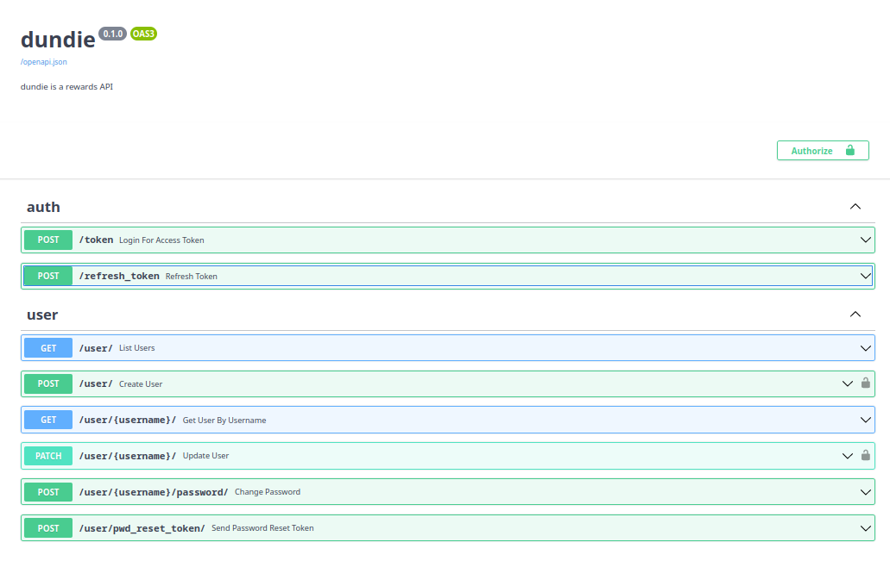

# Enviando emails assíncronos

Ao chamar a URL `/user/pwd_reset_token/` a resposta demorou 3 segundos pois estamos bloqueando o request até o e-mail ser enviado, o ideal é que isso seja feito em background, vamos transformar a chamada de `try_to_send_pwd_reset_email` em uma task.


O FastAPI tem uma classe chamada `BackgroundTasks` que nos permite adicionar funções que serão executadas em background, vamos importá-la e adicioná-la como um parâmetro da nossa rota.

As funções que adicionarmos a background_tasks serão adicionadas ao event-loop assíncrono gerenciado pelo FastAPI, desta forma não será necessário esperar o tempo de envio do e-mail, podemos retornar a resposta para o cliente e mesmo depois do request terminado a tarefa continuará executando do lado servidor.

**EDITE** `dundie/routes/user.py`

```python
# No topo
from fastpi import BackgroundTasks
...


# Na função
@router.post("/pwd_reset_token/")
async def send_password_reset_token(
    *,
    email: str = Body(embed=True),
    background_tasks: BackgroundTasks,  # NEW
):
    background_tasks.add_task(try_to_send_pwd_reset_email, email=email)  # NEW
    return {
        "message": "If we found a user with that email, we sent a password reset token to it."
    }
```

Pode testar repetindo a mesma chamada anterior (ou usando a UI em /docs/)

```bash
curl -X 'POST' -H 'Content-Type: application/json' \
--data-raw '{"email": "mscott@dm.com"}' -k \
'http://localhost:8000/user/pwd_reset_token/'
```

Repare que agora a resposta é instantânea e o e-mail é enviado em background.

---

Assim terminamos a API de gestão de usuários e Auth por enquanto



```admonish tip "DICA"
A tareda de envio de e-mail é bastante simples e não muito complexa em questões de resiliência a falhas,
se o e-mail falhar o envio, o usuário simplesmente não vai receber e portanto irá tentar novamente.

Existem casos onde as tarefas precisam de um pouco mais de robustes e controles como retry e auditoria,
neste caso usaremos um gerenciador de filas como Celery ou Python-RQ, mas isso veremos adiante.
```

Com estas rotas agora já podemos ter um front-end integrado para a gestão de usuários, mas o nosso próximo passo será cuidar da API de transações --> 
