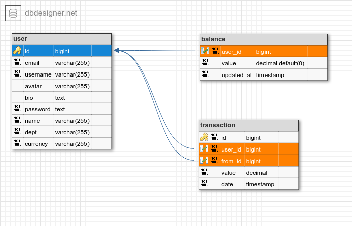
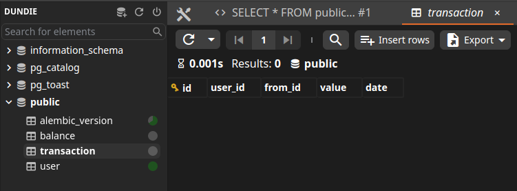

# Modelagem de dados

A modelagem dos dados será a seguinte (considerando que já concluimos a tabela de User), fica faltando implementar as outras 2 tabelas.



[https://dbdesigner.page.link/GqDU95ApwZs7a9RH9](https://dbdesigner.page.link/GqDU95ApwZs7a9RH9)

Portanto criaremos os models para `Transaction` e `Balance`

**EDITE** `dundie/models/transaction.py`

```python
from datetime import datetime
from typing import TYPE_CHECKING, Optional

from sqlmodel import Field, Relationship, SQLModel

if TYPE_CHECKING:
    from dundie.models.user import User


class Transaction(SQLModel, table=True):
    """Represents the Transaction Model"""

    id: Optional[int] = Field(default=None, primary_key=True)
    user_id: int = Field(foreign_key="user.id", nullable=False)
    from_id: int = Field(foreign_key="user.id", nullable=False)
    value: int = Field(nullable=False)
    date: datetime = Field(default_factory=datetime.utcnow, nullable=False)

    # Populates a `.incomes` on `User`
    user: Optional["User"] = Relationship(
        back_populates="incomes",
        sa_relationship_kwargs={"primaryjoin": 'Transaction.user_id == User.id'},
    )
    # Populates a `.expenses` on `User`
    from_user: Optional["User"] = Relationship(
        back_populates="expenses",
        sa_relationship_kwargs={"primaryjoin": 'Transaction.from_id == User.id'},
    )


class Balance(SQLModel, table=True):
    """Store the balance of a user account"""

    user_id: int = Field(
        foreign_key="user.id",
        nullable=False,
        primary_key=True,
        unique=True,
    )
    value: int = Field(nullable=False)
    updated_at: datetime = Field(
        default_factory=datetime.utcnow,
        nullable=False,
        sa_column_kwargs={"onupdate": datetime.utcnow}
    )

    # Populates a `._balance` on `User`
    user: Optional["User"] = Relationship(back_populates="_balance")
```

Como estamos includindo relacionamentos entre os models `Transaction`, `Balance` e `User` precisamos implementar as respectivas mudanças no `dundie/models/user.py`

- `incomes` irá retornar uma query com todos os pontos que o usuário ganhou
- `expenses` irá retornar uma query com todos os pontos que o usuário gastou
- E `balance` irá retornar o saldo atual do usuário, para balance estamos usando um
  relacionamento one-to-one, por isso precisamos usar o `lazy="dynamic"` e uma 
  property do Python para garantir que caso o saldo seja inexistente sempre tenhamos
  um valor de retorno padrão.

```python
from typing import TYPE_CHECKING, Optional


class User(...):
    ...

    # Populates a `.user` on `Transaction`
    incomes: Optional[list["Transaction"]] = Relationship(
        back_populates="user",
        sa_relationship_kwargs={"primaryjoin": 'User.id == Transaction.user_id'},
    )
    # Populates a `.from_user` on `Transaction`
    expenses: Optional[list["Transaction"]] = Relationship(
        back_populates="from_user",
        sa_relationship_kwargs={"primaryjoin": 'User.id == Transaction.from_id'},
    )
    # Populates a `.user` on `Balance`
    _balance: Optional["Balance"] = Relationship(
        back_populates="user",
        sa_relationship_kwargs={"lazy": "dynamic"}
    )

    @property
    def balance(self) -> int:
        """Returns the current balance of the user"""
        if (user_balance := self._balance.first()) is not None:  # pyright: ignore
            return user_balance.value
        return 0
```

E por fim adicionamos o novo model ao contexto do `dundie/models/__init__.py`

```python
from sqlmodel import SQLModel
from .user import User
from .transaction import Transaction, Balance

__all__ = ["User", "SQLModel", "Transaction", "Balance"]
```

## Criando as migrations 

Com os models criados pediamos ao **alembic** para criar o arquivo de migration com as mudanças que precisam ser aplicadas ao Postgresql.

```console
$ docker-compose exec api alembic revision --autogenerate -m "transaction"
INFO  [alembic.runtime.migration] Context impl PostgresqlImpl.
INFO  [alembic.runtime.migration] Will assume transactional DDL.

INFO  [alembic.autogenerate.compare] Detected added table 'balance'
INFO  [alembic.autogenerate.compare] Detected added table 'transaction'

INFO  [alembic.ddl.postgresql] Detected sequence named 'user_id_seq' as owned by integer column 'user(id)', assuming SERIAL and omitting
  Generating /home/app/api/migrations/versions/8af1cd3be673_transaction.py ...  done
```

E em sequencia aplicamos para criar as tabelas no banco de dados:

```console
$ docker-compose exec api alembic upgrade head
INFO  [alembic.runtime.migration] Context impl PostgresqlImpl.
INFO  [alembic.runtime.migration] Will assume transactional DDL.
INFO  [alembic.runtime.migration] Running upgrade f39cbdb1efa7 -> b0abf3428204, transaction
```

Neste momento nossas tabelas `transaction` e `balance` já devem estar criadas.

**Antares SQL**


Agora vamos criar a lógica de negócios que cuidará da adição de novas transações -->

