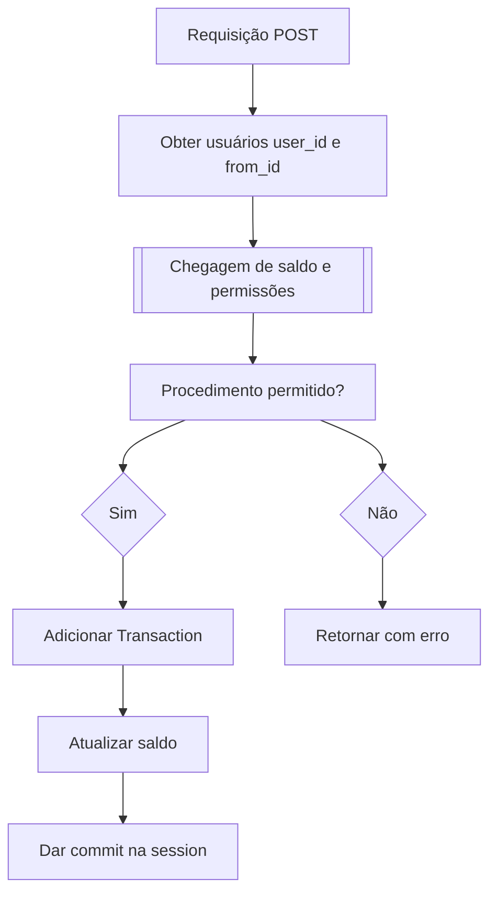

# Transaction Business Logic

A operação de adicionar uma transação será feita com uma requisição `POST` ao endpoint `/transaction/{username}/`
e o corpo da transaction será:

```json
{
  "value": "integer",
}
```

O usuário autenticado através de token será usado para popular o campo `from_id` e o campo `date` será
preenchido automaticamente.

> **NOTE** Via `CLI` também será possivel adicionar transaction, e neste caso o `from_id` será o user `admin` (que precisamos garantir a criação via migrations)

### Fluxo de operação



### Atualizando Saldo

Vamos criar uma função com a lógica necessária para adicionar transaction e atualizar
o saldo baseando-se nas regras anteriores.

**EDITE** `dundie/tasks/transaction.py`

```python
from typing import Optional
from sqlmodel import Session
from dundie.db import engine
from dundie.models import User, Transaction, Balance


class TransactionError(Exception):
    """Can't add transaction"""


def add_transaction(
    *,
    user: User,
    from_user: User,
    value: int,
    session: Optional[Session] = None
):
    """Adds a new transaction to the specified user.

    params:
        user: The user to add transaction to.
        from_user: The user where amount is coming from or superuser
        value: The value being added
    """
    if not from_user.superuser and from_user.balance < value:
        raise TransactionError("Insufficient balance")

    session = session or Session(engine)

    transaction = Transaction(user=user, from_user=from_user, value=value)  # pyright: ignore
    session.add(transaction)
    session.commit()
    session.refresh(user)
    session.refresh(from_user)

    for holder in (user, from_user):
        total_income = sum([t.value for t in holder.incomes])  # pyright: ignore
        total_expense = sum([t.value for t in holder.expenses])  # pyright: ignore
        balance = session.get(
            Balance, holder.id
        ) or Balance(user=holder, value=0)  # pyright: ignore
        balance.value = total_income - total_expense
        session.add(balance)

    session.commit()
```

A função `add_transaction` recebe como parâmetros o `user` que receberá a transação, o `from_user` que é o usuário que está enviando a transação e o `value` que é o valor da transação, esta função será executado tanto via CLI quanto via REST API.

Para que funcione via CLI precisamos garantir que o sistema sempre tenha um usuário `admin` padrão para o sistema, vamos garantir a existência deste usuário -->
