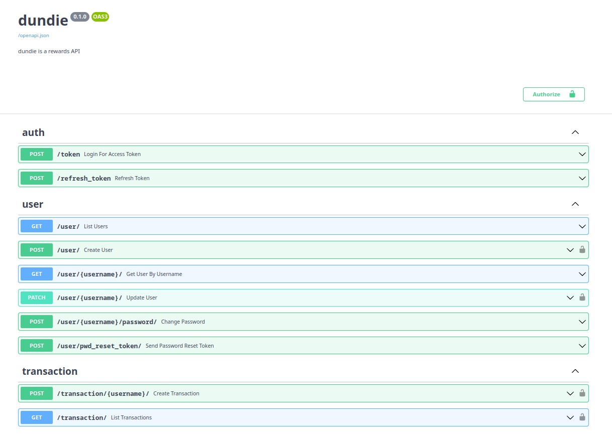

# Expondo saldo do usuário

Na listagem de usuário está faltando exibir o saldo total do usuário, 
esta é uma informação sensivel e portanto estará disponível apenas em
alguns casos.

- `?show_balance=true` for passado na URL das rotas GET de /user/
- O usuário logado é superuser ou
- O usuário logado está acessando sua própria conta


**EDITE** o arquivo `dundie/auth.py` e vamos adicionar mais uma dependencia 
baseada em autenticação.

```python

async def show_balance_field(
    *,
    request: Request,
    show_balance: Optional[bool] = False,  # from /user/?show_balance=true
) -> bool:
    """Returns True if one of the conditions is met.
    1. show_balance is True AND
    2. authenticated_user.superuser OR
    3. authenticated_user.username == username
    """
    if not show_balance:
        return False

    username = request.path_params.get("username")

    try:
        authenticated_user = get_current_user(token="", request=request)
    except HTTPException:
        authenticated_user = None

    if any(
        [
            authenticated_user and authenticated_user.superuser,
            authenticated_user and authenticated_user.username == username,
        ]
    ):
        return True

    return False


ShowBalanceField = Depends(show_balance_field)
```

Agora precisamos de um serializer contendo o campo `balance` e posteriormente no endpoint 
usaremos este serializer como retorno apenas quando a dependência acima for satisfeita, 
usando uma abordagem chamada **conditional response model**

**EDITE** `dundie/models/user.py`


```python
# Logo abaixo da classe UserResponse

class UserResponseWithBalance(UserResponse):
    balance: Optional[int] = None

    @root_validator(pre=True)
    def set_balance(cls, values: dict):
        """Sets the balance of the user"""
        instance = values["_sa_instance_state"].object
        values["balance"] = instance.balance
        return values
```


Agora **EDITE** o `dundie/routes/user.py` e vamos usar a dependencia
nos endpoints `list_users` e `get_user_by_username` e além de adicionar 
a dependencia vamos alterar o `responde_model` tornando o condicional.

```python
# IMPORTS 
from fastapi.encoders import jsonable_encoder
from fastapi.responses import JSONResponse
from pydantic import parse_obj_as
from dundie.auth import ShowBalanceField
from dundie.models.user import UserResponseWithBalance

# list_users 

@router.get(
    "/",
    response_model=List[UserResponse] | List[UserResponseWithBalance],
    response_model_exclude_unset=True,
)
async def list_users(
    *, session: Session = ActiveSession, show_balance_field: bool = ShowBalanceField
):
    """List all users.

    NOTES:
    - This endpoint can be accessed with a token authentication
    - show_balance query parameter takes effect only for authenticated superuser.
    """
    users = session.exec(select(User)).all()
    if show_balance_field:
        users_with_balance = parse_obj_as(List[UserResponseWithBalance], users)
        return JSONResponse(jsonable_encoder(users_with_balance))
    return users

# get user by username 
@router.get(
    "/{username}/",
    response_model=UserResponse | UserResponseWithBalance,
    response_model_exclude_unset=True,
)
async def get_user_by_username(
    *, session: Session = ActiveSession, username: str, show_balance_field: bool = ShowBalanceField
):
    """Get user by username"""
    query = select(User).where(User.username == username)
    user = session.exec(query).first()
    if not user:
        raise HTTPException(status_code=404, detail="User not found")
    if show_balance_field:
        user_with_balance = parse_obj_as(UserResponseWithBalance, user)
        return JSONResponse(jsonable_encoder(user_with_balance))
    return user
```

Você pode testar essa funcionalidade fazendo chamadas a URL `/user/` e `/user/{username}` e verificar que
quando o argumento `?show_balance=true` for passado na URL, o serializer de retorno irá conter o campo 
do saldo, mas isso só será feito se o usuário for o superuser, ou o próprio usuário autenticado.


## A API está pronta!



Não é bem assim... nada está pronto enquanto não tiver cobertura de testes -->
